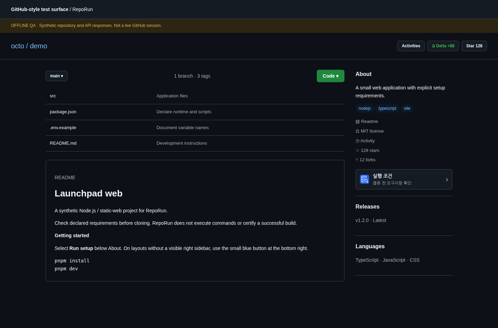

<div align="center">
  
  <h1>RepoRun</h1>
  <p><strong>클론 전에 실행 조건부터.</strong></p>
  <p>설정 파일의 근거를 읽고, 명령은 실행하지 않습니다.</p>
  <p><a href="README.md">English</a> · <strong>한국어</strong></p>
</div>

RepoRun 1.0.1은 GitHub 저장소를 내려받기 전에 Node.js·정적 웹 프로젝트의 실행 조건을 살펴보는 Chrome Manifest V3 확장프로그램입니다. **실행 조건** 버튼을 눌러 루트 또는 직접 지정한 디렉터리를 분석합니다. 결과는 **명시됨 / 추정됨 / 확인되지 않음**으로 구분하며, 근거 링크는 기본 브랜치의 한 커밋에 고정합니다.

> 구현과 테스트가 포함된 초기 배포 패키지입니다. 오프라인 브라우저 검사와 실제 Dedicated Worker의 fetch 검사는 통과했습니다. 관리형 실행 환경 때문에 실제 MV3 설치·GitHub 및 PAT 연동·네이티브 파일 다운로드는 검증하지 못했습니다. [QA 보고서](docs/QA-KR.md)



*실제 앱 렌더러와 모의 저장소·API를 사용한 화면입니다. 실제 GitHub 연동 화면은 아닙니다.*

## 1.0.1 변경

상단의 Activities·Delta·Star 액션 영역에 RepoRun 버튼을 넣지 않습니다. 우측 About 영역 하단에 실행 조건 버튼을 배치하고, 사이드바가 없거나 숨겨졌거나 본문 아래에 쌓이는 좁은 화면에서는 우측 하단의 44px 아이콘 버튼으로 전환합니다. 리사이즈와 GitHub 내부 이동 중에도 버튼은 하나만 유지합니다.

모든 활성 화면과 설치 아이콘을 블루 체크리스트·돋보기 로고로 통일했습니다. API·토큰·분석 로직과 권한은 변경하지 않았습니다. [배치 규칙](docs/PLACEMENT-KR.md) · [브랜딩](docs/BRANDING-KR.md)

## 설치

1. `RepoRun-v1.0.1-chrome.zip`을 보관할 폴더에 압축 해제합니다. 최상위에 `manifest.json`이 있습니다. 전체 소스 ZIP에서는 `dist/`를 사용합니다.
2. `chrome://extensions`에서 개발자 모드를 켜고 **압축해제된 확장 프로그램 로드**를 선택합니다.
3. 해당 폴더를 로드한 뒤 기존 GitHub 탭을 새로고침합니다. 저장소에서 **Run setup**을 누르고 **KR**로 전환합니다.
4. 루트는 경로를 비워 두고, 하위 프로젝트는 `apps/web` 같은 상대 경로를 입력하여 **분석**합니다. 다른 브랜치를 열어 놓아도 기본 브랜치를 분석합니다.

매니페스트의 최소 Chrome 버전은 114입니다. 설치용 ZIP에는 Node.js가 필요하지 않습니다. RepoDelta 등 다른 확장의 토큰을 공유하지 않습니다. 공개 저장소는 GitHub 비인증 한도 내에서 토큰 없이 조회하며, 비공개 저장소에는 권한이 필요합니다. 설정에서 대상 저장소의 **Contents 읽기 권한**을 가진 fine-grained PAT를 세션에 저장하고 연결을 진단할 수 있습니다. 토큰 저장 완료는 인증 검증을 의미하지 않습니다.

## 구성

| 화면 | 내용 |
| --- | --- |
| 개요 | 런타임 선언, 패키지 관리자 선언·잠금 파일 단서, 빌드 스크립트, 워크스페이스·플랫폼 선언, 환경변수 이름, 컨테이너 단서 |
| 명령 | `package.json`의 실제 스크립트, 생명주기 훅 경고, 텍스트 복사, README 명령 예시 일부 |
| 근거 파일 | 지원 파일 목록과 읽음·존재만 확인·건너뜀·실패 구분, 커밋 고정 원문 링크 |
| 설정 | EN/KR, 세션 토큰, 연결 진단·호스트 권한 요청, 보고서 캐시 비우기 |
| 내보내기 | 현재 결과와 근거를 포함한 Markdown 보고서 |

런타임은 `engines`, Volta, `devEngines`, `.nvmrc`, `.node-version`, `.tool-versions`의 Node 선언을 확인합니다. 패키지 관리자 명시와 잠금 파일명에 따른 추정을 구분합니다. 환경변수 예제는 **이름만** 남기며 값을 표시하지 않습니다. Dockerfile의 `FROM`은 이미지 선언일 뿐 Docker가 필수라는 판단이 아닙니다. Compose와 동적 설정은 존재를 확인할 뿐 실행 구성을 평가하지 않습니다.

의존성 설치·명령 실행·동적 설정 import·GitHub 쓰기 작업을 하지 않습니다. 복사되는 스크립트는 원문이지 **검증된 실행 절차가 아닙니다.** 패키지 관리자의 PATH·생명주기 훅에 따라 동작이 달라질 수 있습니다. 가림·잘림·여러 줄·제어문자가 포함된 스크립트는 복사를 제한합니다.

## 1.0.1 범위

기본 브랜치의 디렉터리 하나씩, 최대 5단계 경로를 분석합니다. 상위 설정을 상속하거나 워크스페이스 전체를 자동 확장하지 않습니다. Python·Rust·Deno 실행 분석, CI 분석, 사용자 PC 검사, 버전 범위 호환성 계산, 실제 빌드 검증, 설치 명령 자동 생성은 지원하지 않습니다.

`index.html`이나 프레임워크 의존성이 있다고 정적 호스팅이 된다고 판정하지 않습니다. 정적 배포 호환성은 **확인되지 않음**으로 남깁니다. 파일이 없거나 읽히지 않았다는 것을 필수 조건이 없다는 뜻으로 해석하지 않습니다.

본문 조회는 지원 파일 최대 14개를 시도하고 파일당 128 KiB로 제한합니다. `.env`, `.npmrc`, 잠금 파일 본문, 임의 앱 코드는 읽지 않습니다. 심볼릭 링크·서브모듈·LFS 본체·바이너리는 따라가지 않습니다. 제한과 파일별 처리 상태를 표시합니다. [분석 규칙](docs/ANALYSIS-RULES-KR.md)

## 개인정보·API

개발자 서버·별도 계정·이용 분석·광고·AI 서비스·원격 실행 코드가 없습니다. 서비스 워커가 필요한 저장소·Git 식별자와 선택적 토큰을 GitHub에 직접 보내며 쿠키는 제외합니다. `chrome.storage.local`에는 언어만, `chrome.storage.session`에는 토큰·한도 상태·정규화한 보고서 최대 8개를 저장합니다. 캐시 신선도는 5분이며 상시 삭제 타이머는 없습니다. 원문 파일 모음은 캐시나 보고서로 내보내지 않습니다.

보고서와 클립보드에는 비공개 경로·프로젝트 정보나 자동 가림이 놓친 비밀값이 남을 수 있습니다. 공유 전에 검토하세요. 세션 저장소는 암호화 금고가 아닙니다. 토큰 변경 시 보고서를 비우고, Chrome 재시작·확장 재로드 시 세션 자료가 삭제됩니다. [개인정보 처리방침](<https://jtech-co.github.io/RepoRun/public/privacy-policy.html>)

## 빌드·검증

Node.js 22 이상에서 동작합니다. **npm 의존성 설치가 필요하지 않습니다.**

```sh
npm run check
npm test
npm run build
npm run package
```

`package`는 Node 테스트·문법·매니페스트·아이콘 검사를 수행하고 `dist/` 및 `releases/RepoRun-v1.0.1-chrome.zip`을 만듭니다. Chrome ZIP 최상위에는 `manifest.json`이 있고 QA·테스트 파일은 제외됩니다. 선택적 브라우저 테스트는 Python·Playwright·Chromium이 필요합니다. [QA 실행 방법](docs/QA-KR.md)

소스는 `shared`, `background`, `content`, `options`, `popup`으로 나눴습니다. `npm run serve:qa`는 `http://127.0.0.1:5199/qa/index.html`에서 모의 저장소를 제공합니다. UI 개발용이며 실제 API·인증 검증용이 아닙니다.

[아키텍처](docs/ARCHITECTURE-KR.md) · [스토어 등록 안내](docs/STORE-LISTING-KR.md) · [아이콘 관리](docs/BRANDING.md) · [변경 내역](CHANGELOG-KR.md)

GitHub 저장소 생성·푸시·Pages 배포·웹스토어 제출은 수행하지 않았습니다. 스토어 등록 전에 개인정보 처리방침 HTML·CSS·아이콘을 함께 호스팅하고 실제 설치 화면을 준비해야 합니다.

[MIT](LICENSE). JTech-CO의 독립 프로젝트이며 GitHub·Google 공식 제품이 아닙니다.
