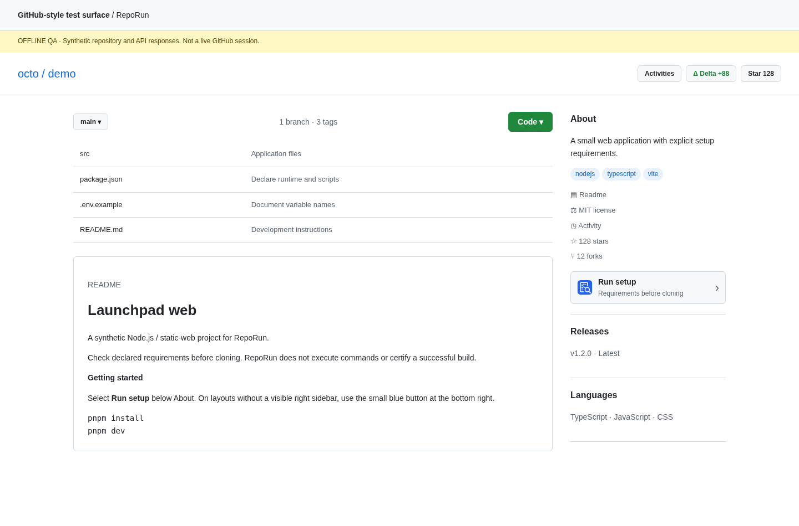

<div align="center">
  
  <h1>RepoRun</h1>
  <p><strong>See What a Repo Needs Before You Clone</strong></p>
  <p>Evidence-first setup inspection for GitHub. No commands executed.</p>
  <p><strong>English</strong> · <a href="README-KR.md">한국어</a></p>
</div>

RepoRun 1.0.1 is a Chrome Manifest V3 extension for inspecting Node.js and static-web setup signals before downloading a repository. Select **Run setup** below **About** on the right sidebar (or the small bottom-right button without a visible sidebar) on a GitHub repository to inspect the root or an explicitly chosen directory. Results distinguish **Declared**, **Inferred**, and **Not established**, with evidence pinned to one commit of the default branch.

> This package contains an implementation and reproducible tests, not a published store listing. Offline browser checks and a native dedicated-Worker fetch test passed. Installed MV3, live GitHub/PAT access, and actual downloads could not be verified in the managed execution environment. See [QA](docs/QA.md).



*Actual application renderer, synthetic repository/API data. Not a screenshot of live GitHub integration.*

## New in 1.0.1

RepoRun no longer occupies the repository header next to Activities, Delta or Star. One launcher moves between About and a compact icon-only fallback as the layout changes; navigation and repeated renders do not create duplicates. A blue checklist-and-magnifier logo replaces the green terminal on all active surfaces. No new permissions, API endpoints, token handling or analysis rules.

[Placement specification](docs/PLACEMENT.md) · [Branding](docs/BRANDING.md)

## Install

1. Extract `RepoRun-v1.0.1-chrome.zip` to a permanent folder. Its root contains `manifest.json`. With the full source package, use `dist/` instead.
2. Open `chrome://extensions`, enable **Developer mode**, choose **Load unpacked**, and select that folder.
3. Reload existing GitHub tabs. Select **Run setup** below the right-hand **About** section. If the sidebar is absent, hidden, too narrow or stacked below the content, use the 44-pixel blue button at the bottom right.
4. Leave Directory empty for the root, or enter a relative path such as `apps/web`, then select **Inspect**. The default branch is used even when you are viewing another branch.

Chrome 114 or newer is the declared minimum. Installing the prebuilt extension does not require Node.js. Tokens are independent of RepoDelta or other extensions. Public repositories can be read without a token within GitHub's allowance; authorized private repositories require appropriate access. Settings supports an optional fine-grained PAT with **Contents: read-only**, session-only storage, and explicit connection diagnostics. Saving a token does not verify it.

## What it does

| View | Result |
| --- | --- |
| Overview | Runtime declarations, package-manager declarations/lockfile clues, build script, workspace/platform declarations, environment names and container clues |
| Commands | Literal `package.json` scripts, lifecycle-hook warning, Copy control, and a small README command sample |
| Evidence | Selected setup files, read/presence-only/skipped/failed status, and commit-pinned source links |
| Settings | EN/KR, session token removal, API diagnostics/host access request and cache clearing |
| Export | A user-initiated Markdown report containing the current result and evidence |

Runtime signals include `engines`, Volta, `devEngines`, `.nvmrc`, `.node-version` and Node entries from `.tool-versions`. Package-manager hints distinguish an explicit declaration from a lockfile filename. Environment examples contribute **names only**, never assignment values. Dockerfile `FROM` declarations are clues, not proof that Docker is mandatory. Compose/config files are detected but not evaluated as runnable configuration.

RepoRun never installs dependencies, runs repository commands, imports executable configuration or writes to GitHub. Script Copy is literal text, **not a verified launch instruction**; a package manager may supply PATH entries and lifecycle hooks. Redacted, truncated, multiline or control-containing scripts cannot be copied through the button.

## Scope and boundaries

One directory on the default branch per inspection, up to five directory levels. Parent configuration is not inherited; workspaces are not recursively expanded. Python/Rust/Deno execution analysis, CI analysis, user-device detection, compatibility-range solving, actual build tests and automatic installation instructions are outside 1.0.1.

An `index.html` or a framework dependency does **not** certify static hosting. RepoRun intentionally leaves static-hosting compatibility as **Not established**. Missing or unreadable evidence must not be treated as proof that no requirement exists.

A scan attempts at most 14 supported file bodies, each at most 128 KiB; it does not read `.env`, `.npmrc`, dependency lockfile bodies or arbitrary application source files. Symlinks, submodules, LFS payloads and binary content are not followed. Limits and file treatment are disclosed. See [analysis rules](docs/ANALYSIS-RULES.md).

## Privacy and API

No publisher backend, account, analytics, ads, AI service or remote executable code. The service worker sends necessary repository/Git identifiers and an optional token directly to GitHub. Cookies are omitted. Only language is durable in `chrome.storage.local`; token, quota state and up to eight normalized reports are in `chrome.storage.session`. Report freshness is five minutes, not a continuously running deletion timer. Raw file maps are not cached or exported.

Reports and clipboard text may still contain private paths, project details or secrets not caught by best-effort redaction. Inspect before sharing. Session storage is not an encrypted vault. Token changes clear cached reports; browser restart or extension reload clears session data. [Bundled privacy policy](<https://jtech-co.github.io/RepoRun/public/privacy-policy.html>).

## Build and test

Requires Node.js 22+. There are **no npm dependencies** and no build-time fetches.

```sh
npm run check
npm test
npm run build
npm run package
```

`package` runs Node tests, validates syntax/manifest/icon hashes, builds `dist/`, and creates `releases/RepoRun-v1.0.1-chrome.zip` with `manifest.json` at the root. Source and tests stay out of the installation ZIP. Optional browser checks require Python, Playwright and an available Chromium installation; see [QA](docs/QA.md).

```text
src/shared/       Validation, deterministic analyzer, i18n, DOM helpers and styles
src/background/   Bound-fetch API client, session store, scan orchestration, messaging
src/content/      About/floating placement, modal and navigation handling
src/options/      Token, language and diagnostics UI
src/popup/        Toolbar entry point
public/           Manifest, icon assets, help, privacy and locale descriptions
scripts/          Dependency-free build, test, ZIP writer and local QA server
qa/               Synthetic repository and Chrome/API adapters (not distributed)
tests/            Node regression and offline Chromium tests
```

`npm run serve:qa` serves a **simulation** at `http://127.0.0.1:5199/qa/index.html`. Its API responses are fixtures, not real GitHub data. Use it for UI development, never as evidence of live authorization.

## Documentation

[Architecture](docs/ARCHITECTURE.md) · [Analysis rules](docs/ANALYSIS-RULES.md) · [QA](docs/QA.md) · [Chrome Web Store copy](docs/STORE-LISTING.txt) · [Branding](docs/BRANDING.md) · [Changelog](CHANGELOG.md)

No GitHub repository, Pages deployment or Web Store listing was created by this package. Host `public/privacy-policy.html` together with its CSS/icons before submission. Use real installed-extension screenshots when claiming live integration.

[MIT](LICENSE). Independent project by JTech-CO; not affiliated with GitHub or Google.
